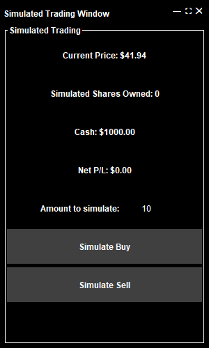
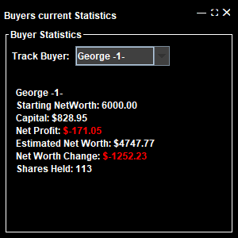

# Final : Stock Market Simulation
---
## What is aims to do
This will be a simulation of 5 buyers with different habits and how they affect a stock price base on those habits. Furthermore certain 

## The UI
Here is the Main UI :\
\
The UI has many different Parts to it : 

- ### The news
On the top of the UI will scroll from left ot right relevant events that happened to the Stock. it will say the news and how much it affected the stock itself.

- ### The Top Right
On the Top right we have 
- The Current Stock Price
- The Market Cap, bassicaly shows what the value of the entire stocks would be
- The market State, Crashing, Declining, Stable, Rising, or Booming 
- The Time, each tick is an hour and the UI, for stability, only adds a point after 10 ticks, so the time jumps by 10 hours each time 

- ### The Arrows 
The Arrows are used to manipulat the stock, you dont need to use them neither will you have to.

- ### Pause
Simple, pauses the market
- ### Hide Line
Hides/Show the Cyan line
- ### Hide/Show Candles 
Shows or hide the candle graph
- ### Keep History 
will control either we keep old data or we trim it, meaning disregard old data and only show the last 500h of data.
- ### Toggle Trading UI
The Trading UI is a UI given in order to trade in the simulated market.\
here's what it looks like :\
\
This shows everything that you have and the current price of the market for example here the current price is 41.94. you own 0 stocks, and have 1000$ left to spend.
no profit or loss since, no trade was made. You can also change the amount of stocks you buy or sell at once by simply clicking and editing the Amount to simulate: 10 

- ### Toggle Stats UI
\
This is pretty simple you can chose which buyer to look on their stats. simply click on "track buyer:" and select the buyer you want.

## Design Patterns
1. ### Singleton 
The First Design Pattern i made was the 
2. ### Observer 
The Observer pattern is used between the [StockMarket](src/StockMarket.java) and the [Stock](src/Stock.java), and the stock with the buyers. The stock market calculates a new price for hte stock market and then notifies the Stock of this new price, Buyers observe changes in the stock's price and react accordingly. When the stock updates, it notifies all registered buyers so they can make decisions based on the new price.
3. ### Strategy
The Strategy pattern is used to define different trading behaviors for each buyer. For example, aggressive, random, or conservative buyers use different decision-making logic, but all share a common interface. This allows flexible and interchangeable strategies.
4. ### Mediator
The Mediator pattern is used via [StockMarket](src/StockMarket.java) (or centralized market logic) that coordinates the communication between buyers and the stock. Buyers don’t trade directly with each other or the stock—they go through the market, which processes and validates all trades.

5. ### Factory
The Factory pattern is used to create instances of buyers. Depending on the simulation input or configuration, the factory can generate different types of buyers with specific strategies or trust levels. This simplifies object creation and encapsulates the logic.

### Stock market 