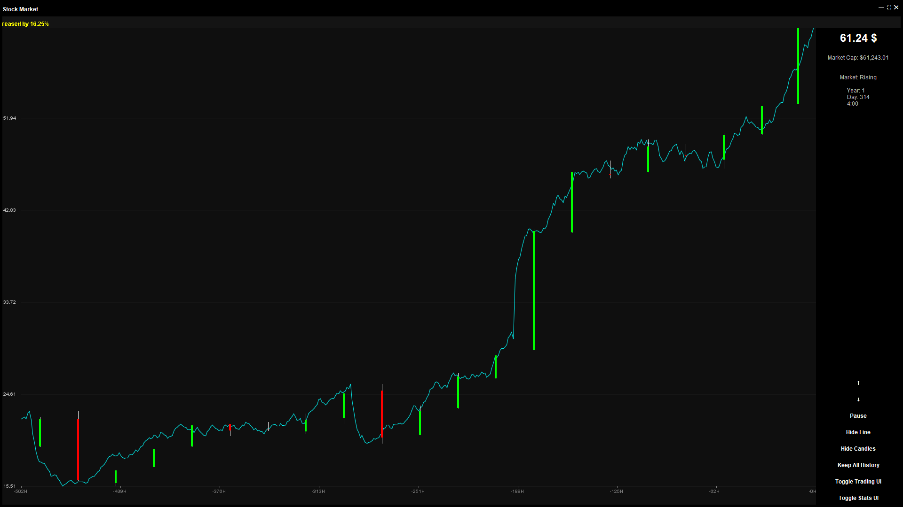

# Final : Stock Market Simulation
---
## What is aims to do
This will be a simulation of 5 buyers with different habits and how they affect a stock price base on those habits. Furthermore certain 

## The UI
Here is the Main UI :\
\
The UI has many different Parts to it : 

- ### The Arrows 
The Arrows are used to manipulat the stock, you dont need to use them neither will you have to.
## Design Patterns

### Stock market 